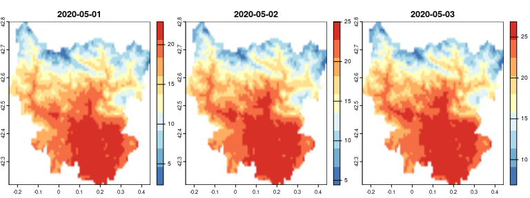

<!-- README.md is generated from README.Rmd. Please edit that file -->

```{r, include = FALSE}
library(knitr)
knitr::opts_chunk$set(
  collapse = TRUE,
  comment = "#>",
  fig.path = "man/figures/README-",
  cache = TRUE
)

```

# `easyclimate` <a href='https://verughub.github.io/easyclimate/'></a>

# Easy access to high-resolution daily, monthly and annual climate data for Europe

<!-- badges: start -->

`r badger::badge_cran_release()`  <a href="https://diffify.com/R/easyclimate" target="_blank"></a> [](https://www.repostatus.org/#active) [](https://github.com/VeruGHub/easyclimate/actions/workflows/R-CMD-check.yaml) [](https://cran.r-project.org/package=easyclimate)

<!-- badges: end -->

Get high-resolution (1 km) daily, monthly and annual climate data (precipitation, and average, minimum and maximum temperatures) for Europe from the European climatic database hosted at the [Institute of Silviculture, University of Natural Resources and Life Sciences, Vienna, Austria](https://boku.ac.at/en/oekb/wald). Climate data are available from 1950 onwards. These data are updated annually (generally in July) to include information up to the previous year (e.g., the July 2026 update includes new data up to the end of 2025).

This climate dataset was originally built by [A. Moreno & H. Hasenauer](https://doi.org/10.1002/joc.4436) and further developed by W. Rammer, C. Pucher & M. Neumann.

-    See [this document](https://eur03.safelinks.protection.outlook.com/?url=https%3A%2F%2Fgithub.com%2FVeruGHub%2Feasyclimate%2Fblob%2Fmaster%2Finst%2FDescription_Evaluation_Validation_Downscaled_Climate_Data_v2.pdf&data=05%7C02%7Csofia.miguelr%40uah.es%7C84b8bb0fe5f1419f565208dee979d02b%7Cced2c5527d1f4731aa3a2f0ec9629e26%7C1%7C0%7C639204906875340483%7CUnknown%7CTWFpbGZsb3d8eyJFbXB0eU1hcGkiOnRydWUsIlYiOiIwLjAuMDAwMCIsIlAiOiJXaW4zMiIsIkFOIjoiTWFpbCIsIldUIjoyfQ%3D%3D%7C0%7C%7C%7C&sdata=iHEu0gkEv8H2w72eE4iHVOe67R8HRRu32dI1MyJySdk%3D&reserved=0 "Original URL: https://github.com/VeruGHub/easyclimate/blob/master/inst/Description_Evaluation_Validation_Downscaled_Climate_Data_v2.pdf. Click or tap if you trust this link.") for more details on the initial development and characteristics of the climatic dataset.

-   See [this document](https://eur03.safelinks.protection.outlook.com/?url=https%3A%2F%2Ffigshare.com%2Farticles%2Fonline_resource%2FDescription_of_Downscaled_European_Climate_Data%2F33078053&data=05%7C02%7Csofia.miguelr%40uah.es%7C84b8bb0fe5f1419f565208dee979d02b%7Cced2c5527d1f4731aa3a2f0ec9629e26%7C1%7C0%7C639204906875398194%7CUnknown%7CTWFpbGZsb3d8eyJFbXB0eU1hcGkiOnRydWUsIlYiOiIwLjAuMDAwMCIsIlAiOiJXaW4zMiIsIkFOIjoiTWFpbCIsIldUIjoyfQ%3D%3D%7C0%7C%7C%7C&sdata=vna5GjW%2FmsHuFf0HMuNsCjpCXD%2F3C98mlrfskxf7toE%3D&reserved=0 "Original URL: https://figshare.com/articles/online_resource/Description_of_Downscaled_European_Climate_Data/33078053. Click or tap if you trust this link.") for the updates of the last version which includes annual updates.

-   See [this document](https://eur03.safelinks.protection.outlook.com/?url=https%3A%2F%2Fdoi.org%2F10.6084%2Fm9.figshare.22962671.v1&data=05%7C02%7Csofia.miguelr%40uah.es%7C84b8bb0fe5f1419f565208dee979d02b%7Cced2c5527d1f4731aa3a2f0ec9629e26%7C1%7C0%7C639204906875453250%7CUnknown%7CTWFpbGZsb3d8eyJFbXB0eU1hcGkiOnRydWUsIlYiOiIwLjAuMDAwMCIsIlAiOiJXaW4zMiIsIkFOIjoiTWFpbCIsIldUIjoyfQ%3D%3D%7C0%7C%7C%7C&sdata=1uvC%2FV4mOCuPU0wvrPlzWDkHMQI7zw6NH%2Fr0YSz9X3I%3D&reserved=0 "Original URL: https://doi.org/10.6084/m9.figshare.22962671.v1. Click or tap if you trust this link.") for details on previous version (v4) of the dataset.

In this R package we implemented [Cloud-Optimised Geotiffs](http://cogeo.org/) so that we can obtain daily, monthly and climate data for thousands of sites/dates within seconds/minutes, without having to download huge rasters. But if you need to obtain data for large areas, please download the rasters from the FTP server (<ftp://palantir.boku.ac.at/Public/ClimateData/>) and extract the values locally rather than using this package, so as not to saturate the file server. For that, you may use a FTP client such as [FileZilla](https://filezilla-project.org/).

Please, be aware that data will be updated in an annual basis and values for past years might have small adjustments according to the annual spring releases of [E-OBS data](https://surfobs.climate.copernicus.eu/dataaccess/access_eobs.php#datafiles). If you need to guarantee reproducibility of your analyses, please save the data locally as some data might change without notice after such updates.

For a detailed description of {easyclimate}, please read [this paper](https://doi.org/10.1016/j.envsoft.2023.105627) (open access version [here](https://doi.org/10.32942/osf.io/mc8uj)) or visit the package [website](https://verughub.github.io/easyclimate/).

## Installation

Stable version from [CRAN](https://cran.r-project.org/package=easyclimate):

```{r, eval = FALSE}
install.packages("easyclimate")
```

Development version from [GitHub](https://github.com/VeruGHub/easyclimate):

```{r, eval = FALSE}
# install.packages("remotes")
remotes::install_github("VeruGHub/easyclimate")
```

Development version from [R-universe](https://verughub.r-universe.dev/easyclimate):

```{r, eval = FALSE}
install.packages('easyclimate', 
                 repos = c('https://verughub.r-universe.dev', 'https://cloud.r-project.org'))
```

## Examples

### Obtain a data frame of climatic values

To obtain a data frame of daily and monthly climatic values for point coordinates:

```{r example_daily, message = FALSE}
library(easyclimate)

coords <- data.frame(lon = -5.36, lat = 37.40)

prec_daily <- get_daily_climate(coords, 
                                period = "2001-01-01:2001-01-03", 
                                climatic_var = "Prcp")
```

```{r echo = FALSE}
kable(prec_daily)
```

```{r example_monthly, message = FALSE}
prec_monthly <- get_monthly_climate(coords,
                                    period = "2001-01:2001-03",
                                    climatic_var = "Prcp")
```

```{r echo = FALSE}
kable(prec_monthly)
```

<br>

### Obtain a raster of climatic values

To obtain a (multi-layer) raster of daily climatic values for an area:

```{r message = FALSE, warning = FALSE, fig.width = 8, fig.height = 3}
library(terra)

## Download the polygon contour of a region
sobrarbe <- mapSpain::esp_get_comarca(comarca = "Sobrarbe")

## Coordinates must be in lonlat 
sobrarbe <- project(vect(sobrarbe), "EPSG:4326")

## Download Tmax values for that region between 1st and 3rd May 2020
sobrarbetemp <- get_daily_climate(
  coords = sobrarbe,
  climatic_var = "Tmax",
  period = "2020-05-01:2020-05-03",
  output = "raster"
)
```

The output (`sobrarbetemp`) is a SpatRaster with 3 layers (for each of 3 days):

```{r}
sobrarbetemp
```

Let's make a map. First using terra:

```{r map_terra, eval = FALSE}
plot(sobrarbetemp, col = rev(RColorBrewer::brewer.pal(9, "RdYlBu")), 
     smooth = TRUE, nc = 3)
```



Now using ggplot2 and tidyterra:

```{r map_ggplot, message = FALSE, fig.width = 8, fig.height = 3}
library(ggplot2)
library(tidyterra)

ggplot() +
  geom_spatraster(data = sobrarbetemp) +
  facet_wrap(~lyr, ncol = 3) +
  scale_fill_distiller(palette = "RdYlBu", na.value = "transparent") +
  geom_spatvector(data = sobrarbe, fill = NA) +
  labs(fill = "Maximum\ntemperature (ºC)") +
  scale_x_continuous(breaks = c(-0.25, 0, 0.25)) +
  scale_y_continuous(breaks = seq(42.2, 42.8, by = 0.2)) +
  theme_minimal()
```

<br> Visit the articles of the [package website](https://verughub.github.io/easyclimate/) for more extended tutorials!

<br>

## CITATION

If you use {easyclimate}, please cite both the appropriate data source and the package as:

```{r echo = FALSE, results = 'asis', cache = FALSE}
print(citation("easyclimate"), style = "text")
```
