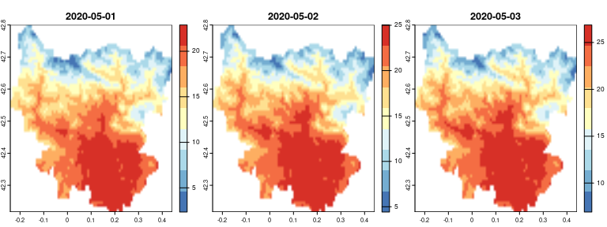

<!-- README.md is generated from README.Rmd. Please edit that file -->

```{r, include = FALSE}
library(knitr)
knitr::opts_chunk$set(
  collapse = TRUE,
  comment = "#>",
  fig.path = "man/figures/README-",
  cache = TRUE
)

```


# `easyclimate` <a href='https://verughub.github.io/easyclimate/'></a>

# Easy access to high-resolution daily climate data for Europe

<!-- badges: start -->

`r badger::badge_cran_release()`

<a href="https://diffify.com/R/easyclimate" target="_blank"></a>
[](https://www.repostatus.org/#active) [](https://github.com/VeruGHub/easyclimate/actions/workflows/R-CMD-check.yaml)
[](https://hits.dwyl.com/VeruGHub/easyclimate)
[](https://hits.dwyl.com/VeruGHub/easyclimate)
[](https://cran.r-project.org/package=easyclimate)

<!-- badges: end -->

Get high-resolution (1 km) daily climate data (precipitation, minimum and maximum temperatures) for Europe from the European climatic database hosted at [University of Natural Resources and Life Sciences, Vienna, Austria](https://boku.ac.at/en/wabo/waldbau/wir-ueber-uns/daten). Data are currently available from 1950 to 2022.

This climatic dataset was originally built by [A. Moreno & H. Hasenauer](https://doi.org/10.1002/joc.4436) and further developed by W. Rammer, C. Pucher & M. Neumann (see [this document](https://github.com/VeruGHub/easyclimate/blob/master/inst/Description_Evaluation_Validation_Downscaled_Climate_Data_v2.pdf) for more details on the development and characteristics of the climatic dataset, and [this document](https://doi.org/10.6084/m9.figshare.22962671.v1) for the updates of the last version - v4).

In this R package we implemented [Cloud-Optimised Geotiffs](http://cogeo.org/) so that we can obtain daily climate data for thousands of sites/days within seconds/minutes, without having to download huge rasters. But if you need to obtain data for large areas, please download the rasters from the FTP server (<ftp://palantir.boku.ac.at/Public/ClimateData/>) and extract the values locally rather than using this package, so as not to saturate the file server. For that, you may use a FTP client such as [FileZilla](https://filezilla-project.org/).

For a detailed description of {easyclimate}, please read [this paper](https://doi.org/10.1016/j.envsoft.2023.105627) (open access version [here](https://doi.org/10.32942/osf.io/mc8uj)) or visit the package [website](https://verughub.github.io/easyclimate/).

## Installation

Stable version from CRAN:

``` r
install.packages("easyclimate")
```

Development version from GitHub:
``` r
# install.packages("remotes")
remotes::install_github("VeruGHub/easyclimate")
```

## Examples

### Obtain a data frame of climatic values

To obtain a data frame of daily climatic values for point coordinates:

```{r example, message = FALSE}
library(easyclimate)

coords <- data.frame(lon = -5.36, lat = 37.40)

prec <- get_daily_climate(coords, 
                          period = "2001-01-01:2001-01-03", 
                          climatic_var = "Prcp",
                          version = 4) # default
```

```{r echo=FALSE}
kable(prec)
```

<br>

### Obtain a raster of climatic values

To obtain a (multi-layer) raster of daily climatic values for an area:

```{r message=FALSE, fig.width = 8, fig.height = 3}
library(terra)

## Download the polygon contour of a region
sobrarbe <- mapSpain::esp_get_comarca(comarca = "Sobrarbe")

## Coordinates must be in lonlat 
sobrarbe <- project(vect(sobrarbe), "EPSG:4326")

## Download Tmax values for that region between 1st and 3rd May 2020
sobrarbetemp <- get_daily_climate(
  coords = sobrarbe,
  climatic_var = "Tmax",
  period = "2020-05-01:2020-05-03",
  output = "raster"
)
```

The output (`sobrarbetemp`) is a SpatRaster with 3 layers (for each of 3 days):

```{r}
sobrarbetemp
```

Let's make a map. First using terra:

```{r map_terra, eval=FALSE}
plot(sobrarbetemp, col = rev(RColorBrewer::brewer.pal(9, "RdYlBu")), 
     smooth = TRUE, nc = 3)
```



Now using ggplot2 and tidyterra:

```{r map_ggplot, message=FALSE, fig.width = 8, fig.height = 3}
library(ggplot2)
library(tidyterra)

ggplot() +
  geom_spatraster(data = sobrarbetemp) +
  facet_wrap(~lyr, ncol = 3) +
  scale_fill_distiller(palette = "RdYlBu", na.value = "transparent") +
  geom_spatvector(data = sobrarbe, fill = NA) +
  labs(fill = "Maximum\ntemperature (ºC)") +
  scale_x_continuous(breaks = c(-0.25, 0, 0.25)) +
  scale_y_continuous(breaks = seq(42.2, 42.8, by = 0.2)) +
  theme_minimal()
```

<br> Visit the articles of the [package website](https://verughub.github.io/easyclimate/) for more extended tutorials!

<br>

## CITATION

If you use easyclimate, please cite both the appropriate data source and the package as:

```{r echo=FALSE, results='asis', cache = FALSE}
print(citation("easyclimate"), style = "text")
```
