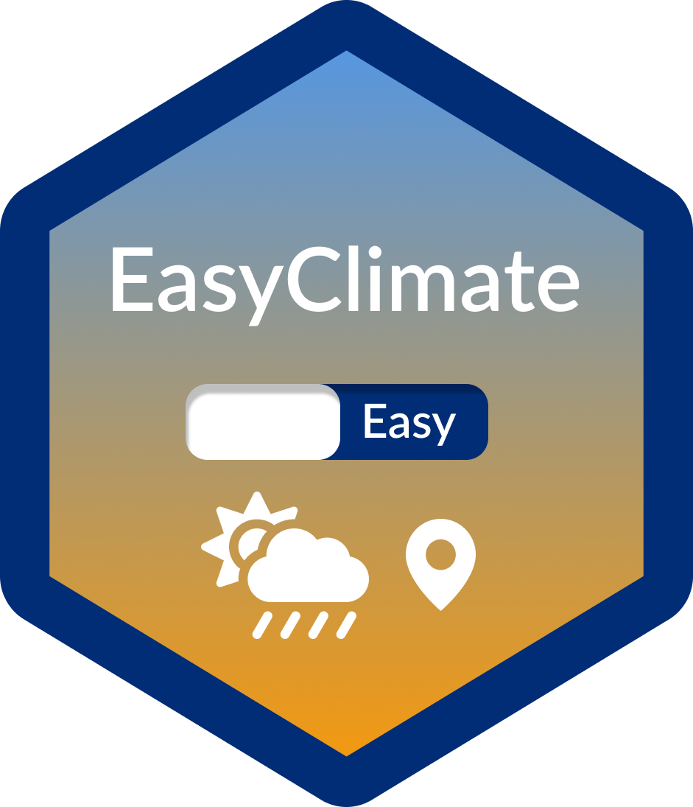
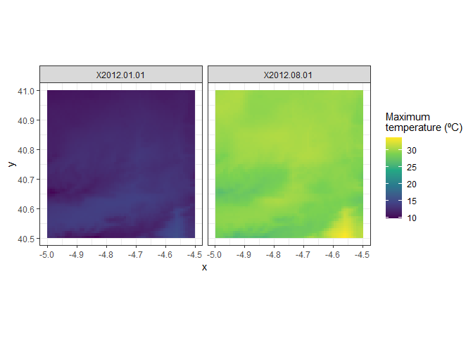

<!-- README.md is generated from README.Rmd. Please edit that file -->

# `easyclimate` <a href='https://verughub.github.io/easyclimate/'></a>

# Easy access to high-resolution daily climate data for Europe

<!-- badges: start -->

[](https://www.repostatus.org/#active)
[](https://github.com/VeruGHub/easyclimate/actions)
[](https://codecov.io/gh/VeruGHub/easyclimate?branch=master)
<!-- badges: end -->

Get high-resolution (1 km) daily climate data (precipitation, minimum
and maximum temperatures) for Europe from the European climatic database
hosted at [University of Natural Resources and Life Sciences, Vienna,
Austria](https://boku.ac.at/en/wabo/waldbau/wir-ueber-uns/daten). Data
are currently available from 1950 to 2017, but subsequent updates are
planned.

This climatic dataset was originally built by [A. Moreno & H.
Hasenauer](https://doi.org/10.1002/joc.4436) and further developed by W.
Rammer, C. Pucher & M. Neumann (see [this
document](https://github.com/VeruGHub/easyclimate/tree/master/inst/Description_Evaluation_Validation_Downscaled_Climate_Data_v2.pdf)
for more details on the development and characteristics of the climatic
dataset).

In this R package we implemented [Cloud-Optimised
Geotiffs](https://www.cogeo.org/) so that we can obtain daily climate
data for thousands of sites/days within minutes, without having to
download huge rasters. But if you need to obtain data for large areas,
please download the rasters from the FTP server
(<ftp://palantir.boku.ac.at/Public/ClimateData/>) and extract the values
locally rather than using this package, so as not to saturate the file
server. For that, you may use a FTP client such as
[FileZilla](https://filezilla-project.org/).

## Installation

``` r
# install.packages("remotes")
remotes::install_github("VeruGHub/easyclimate")
```

## Examples

To obtain a data frame of daily climatic values for point coordinates:

``` r
library(easyclimate)

coords <- matrix(c(-5.36, 37.40), ncol = 2)

prec <- get_daily_climate(coords, 
                          period = "2001-01-01:2001-01-03", 
                          climatic_var = "Prcp")
```

| ID\_coords |     x |    y | date       | Prcp |
|-----------:|------:|-----:|:-----------|-----:|
|          1 | -5.36 | 37.4 | 2001-01-01 |  945 |
|          1 | -5.36 | 37.4 | 2001-01-02 |   12 |
|          1 | -5.36 | 37.4 | 2001-01-03 |  205 |

<br>

To obtain a (multi-layer) raster of daily climatic values for an area:

``` r
library(terra)

coords_poly <- vect("POLYGON ((-4.5 41, -4.5 40.5, -5 40.5, -5 41))")

ras_tmax <- get_daily_climate(
  coords_poly,
  period = c("2012-01-01", "2012-08-01"),
  climatic_var = "Tmax",
  output = "raster" # return raster
  )

ras_tmax <- ras_tmax/100

par(mfrow = c(1, 2))
terra::plot(ras_tmax, 1, col = rev(heat.colors(20)), type = "continuous", smooth = TRUE, range = c(10, 35), legend = FALSE, mar=c(4, 2, 4, 2), main = "January 1 2012")
terra::plot(ras_tmax, 2, col = rev(heat.colors(20)), type = "continuous", smooth = TRUE, range = c(10, 35), mar = c(4, 1, 4, 3), main = "August 1 2012")
```



<br> Visit the articles of the package website for more extended
tutorials!

<br>

## CITATION

If you use easyclimate, please cite both the data source and the package
as:

Moreno A, Hasenauer H (2016). “Spatial downscaling of European climate
data.” *International Journal of Climatology*, 1444–1458. &lt;URL:
<https://doi.org/10.1002/joc.4436>&gt;.

Rammer W, Pucher C, Neumann M (2018). *Description, Evaluation and
Validation of Downscaled Daily Climate Data Version 2*. &lt;URL:
<ftp://palantir.boku.ac.at/Public/ClimateData/>&gt;.

Cruz-Alonso V, Rodríguez-Sánchez F, Pucher C, Ruiz-Benito P, Astigarraga
J, Neumann M, Ratcliffe S (2021). *easyclimate: Easy access to
high-resolution daily climate data for Europe*. &lt;URL:
<https://github.com/VeruGHub/easyclimate>&gt;.
