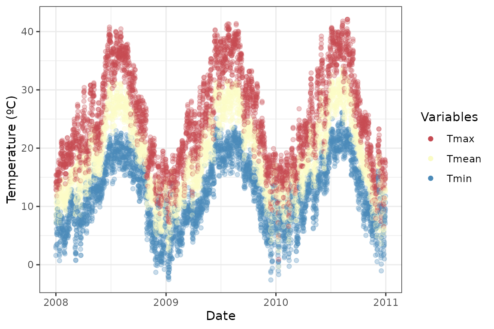
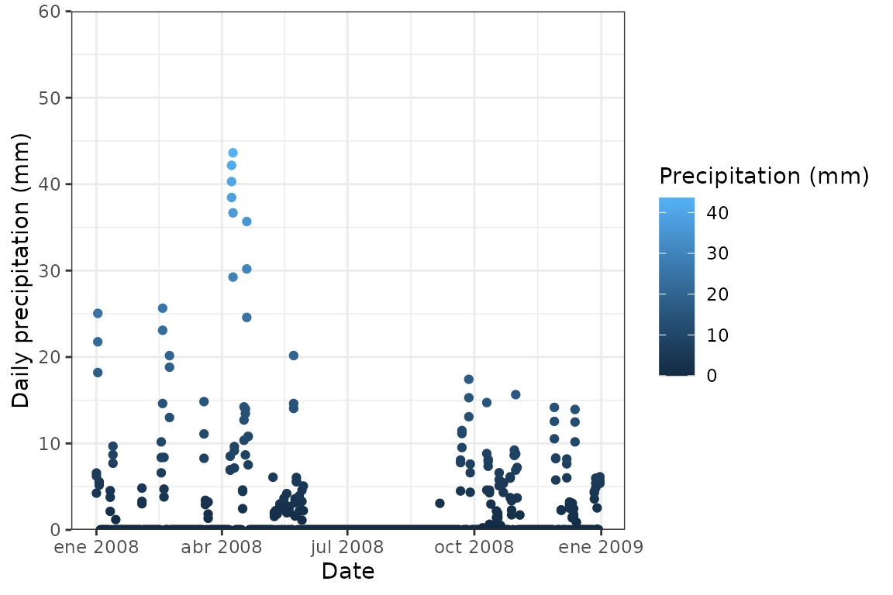

# Analysing the climate at spatial points for a given period

With {easyclimate} you can easily download daily, monthly and annual
climate data for a given set of points or polygons within Europe. To
download and install the latest version of {easyclimate} from GitHub
follow the instructions in <https://github.com/VeruGHub/easyclimate>

  

In this tutorial we will work through the basics of using easyclimate
with coordinate points. You can enter coordinates as a `data.frame`,
`matrix`, `sf` or `SpatVector` object. At the end we will have a data
frame with climate variables for each point.

  

## Example 1: Introducing coordinates as a data frame

First, specify longitude and latitude coordinates in a data frame with
the column names `lon` and `lat`. Here we are simulating coordinates for
three random sites in southern Spain:

``` r
library(easyclimate)
library(ggplot2)
library(dplyr)

coords <- data.frame(
  lon = rnorm(3, mean = -5.36, sd = 0.3), 
  lat = rnorm(3, mean = 37.40, sd = 0.3)
  )

ggplot() +
  borders(regions = c("Spain", "Portugal", "France")) +
    geom_point(data = coords, aes(x = lon, y = lat)) +
  coord_fixed(xlim = c(-10, 2), ylim = c(36, 44), ratio = 1.3) + 
    xlab("Longitude") +
    ylab("Latitude") +
  theme_bw()
```


  

Now, download the climatic data for the selected locations. To get daily
data, all you have to do is use the function `get_daily_climate`,
specifying the period (e.g. `2008-05-25` for a single day or `2008:2010`
for several years), and the variables to be downloaded (precipitation
`Prcp`, minimum temperature `Tmin` or maximum temperature `Tmax`).You
can also use the function `get_monthly_climate`and
`get_annual_climate`to download monthly and annual data, specifying the
period (e.g. `2008-05`for a single month, `2008` for a single year, or
`2008:2010` for several years):

``` r

Sys.time() # to know how much time it takes to download
## [1] "2025-12-18 21:30:13 CET"

daily <- get_daily_climate( # daily data
  coords = coords, 
  period = 2008:2010, 
  climatic_var = c("Prcp", "Tmin", "Tmax")
  )

Sys.time()
## [1] "2025-12-18 21:34:40 CET"

kable(head(daily))
```

| ID_coords |       lon |      lat | date       |  Prcp |  Tmin |  Tmax |
|----------:|----------:|---------:|:-----------|------:|------:|------:|
|         1 | -5.780013 | 37.39833 | 2008-01-01 |  6.95 |  3.62 | 14.24 |
|         1 | -5.780013 | 37.39833 | 2008-01-02 | 25.34 |  8.93 | 15.70 |
|         1 | -5.780013 | 37.39833 | 2008-01-03 |  4.12 |  8.15 | 14.49 |
|         1 | -5.780013 | 37.39833 | 2008-01-04 |  0.00 |  5.31 | 13.91 |
|         1 | -5.780013 | 37.39833 | 2008-01-05 |  0.00 |  5.76 | 14.45 |
|         1 | -5.780013 | 37.39833 | 2008-01-06 |  0.00 | 11.33 | 15.14 |

``` r

Sys.time()
## [1] "2025-12-18 21:34:40 CET"

monthly <- get_monthly_climate( # monthly data
  coords = coords, 
  period = 2008:2010, 
  climatic_var = c("Prcp", "Tmin", "Tavg", "Tmax")
  )

Sys.time()
## [1] "2025-12-18 21:35:04 CET"

kable(head(monthly))
```

| ID_coords |       lon |      lat | date    |   Prcp |  Tmin |  Tavg |  Tmax |
|----------:|----------:|---------:|:--------|-------:|------:|------:|------:|
|         1 | -5.780013 | 37.39833 | 2008-01 |  47.50 |  6.80 | 12.01 | 17.21 |
|         1 | -5.780013 | 37.39833 | 2008-02 |  59.22 |  9.41 | 14.41 | 19.41 |
|         1 | -5.780013 | 37.39833 | 2008-03 |  14.89 |  8.13 | 14.80 | 21.48 |
|         1 | -5.780013 | 37.39833 | 2008-04 | 181.45 | 11.29 | 17.42 | 23.55 |
|         1 | -5.780013 | 37.39833 | 2008-05 |  51.06 | 13.47 | 19.05 | 24.62 |
|         1 | -5.780013 | 37.39833 | 2008-06 |   0.00 | 17.71 | 25.60 | 33.49 |

``` r


annual <- get_annual_climate( # annual data
  coords = coords, 
  period = 2008:2010, 
  climatic_var = c("Prcp", "Tmin", "Tavg", "Tmax")
  )

Sys.time()
## [1] "2025-12-18 21:35:14 CET"

kable(head(annual))
```

| ID_coords |       lon |      lat | date |    Prcp |  Tmin |  Tavg |  Tmax |
|----------:|----------:|---------:|-----:|--------:|------:|------:|------:|
|         1 | -5.780013 | 37.39833 | 2008 |  524.71 | 12.51 | 18.63 | 24.75 |
|         1 | -5.780013 | 37.39833 | 2009 |  609.27 | 13.22 | 19.43 | 25.65 |
|         1 | -5.780013 | 37.39833 | 2010 |  927.66 | 13.48 | 19.02 | 24.57 |
|         2 | -5.283405 | 37.58647 | 2008 |  491.54 | 10.85 | 17.81 | 24.77 |
|         2 | -5.283405 | 37.58647 | 2009 |      NA | 11.74 | 18.71 | 25.68 |
|         2 | -5.283405 | 37.58647 | 2010 | 1046.42 | 12.12 | 18.23 | 24.34 |

Here we extract different components of the date:

``` r
library(lubridate)

daily <- daily |> 
  mutate(
    date = as.Date(date),
    month = months(date),
    year = format(date, format = "%y")
  ) 

monthly <- monthly |> 
  mutate(date = ym(date))
```

  

Finally, you can visualize the daily, monthly and annual climate
results. For example, let’s plot the precipitation for one of the sites:

``` r
clim_daily_site1 <- daily |> 
  filter(ID_coords == 1)

ggplot(clim_daily_site1) +
  geom_line(aes(x = date, y = Prcp), colour = "steelblue") +
  labs(x = "Date", y = "Daily precipitation (mm)") +
  theme_bw()
```


``` r

clim_monthly_site1 <- monthly |> 
  filter(ID_coords == 1)

ggplot(clim_monthly_site1) +
  geom_line(aes(x = date, y = Prcp), colour = "steelblue") +
  labs(x = "Date", y = "Monthly precipitation (mm)") +
  theme_bw()
```


``` r

clim_annual_site1 <- annual |> 
  filter(ID_coords == 1)

ggplot(clim_annual_site1) +
  geom_line(aes(x = date, y = Prcp), colour = "steelblue") +
  labs(x = "Date", y = "Annual precipitation (mm)") +
  scale_x_continuous(breaks = scales::breaks_width(1)) +
  theme_bw()
```


  

Or calculate the daily mean temperature and plot it against `tmin` and
`tmax`:

``` r
library(tidyr)

temp_long <- daily |> 
  mutate(Tmean = (Tmin + Tmax) / 2) |> 
  pivot_longer(
    cols = c("Tmin", "Tmax", "Tmean"),
    names_to = "temp_vars",
    values_to = "temp_values")

ggplot(temp_long, aes(x = factor(ID_coords), y = temp_values, 
                      fill = temp_vars, color = temp_vars)) +
  geom_violin(size = 1, alpha = .7) +
    scale_fill_manual(values = c("#C54A52", "#FAFBC5", "#4B8AB8")) +
  scale_color_manual(values = c("#C54A52", "#FAFBC5", "#4B8AB8")) +
  ylab("Temperature (ºC)") + xlab("") +
  theme_bw()
```


``` r

ggplot(temp_long, aes(x = date, y = temp_values, color = temp_vars)) + 
  geom_point(alpha = .3) +
  scale_color_manual(name = "Variables",
                     values = c("#C54A52", "#FAFBC5", "#4B8AB8"),
                     guide = guide_legend(override.aes = list(alpha = 1))) +
  ylab("Temperature (ºC)") + xlab("Date") +
  theme_bw()
```



  
  

## Example 2: Introducing coordinates as a matrix

{easyclimate} handles different input data, try now with matrices!

Here we are retrieving daily precipitation data for a single year
(2008):

``` r

coords_mat <- as.matrix(coords)

Sys.time()
## [1] "2025-12-18 21:35:17 CET"

mat_prcp <- get_daily_climate( 
  coords = coords_mat, 
  period = 2008, # single year
  climatic_var = "Prcp"
)

Sys.time()
## [1] "2025-12-18 21:35:26 CET"

kable(head(mat_prcp))
```

| ID_coords |       lon |      lat | date       |  Prcp |
|----------:|----------:|---------:|:-----------|------:|
|         1 | -5.780013 | 37.39833 | 2008-01-01 |  6.95 |
|         1 | -5.780013 | 37.39833 | 2008-01-02 | 25.34 |
|         1 | -5.780013 | 37.39833 | 2008-01-03 |  4.12 |
|         1 | -5.780013 | 37.39833 | 2008-01-04 |  0.00 |
|         1 | -5.780013 | 37.39833 | 2008-01-05 |  0.00 |
|         1 | -5.780013 | 37.39833 | 2008-01-06 |  0.00 |

``` r

mat_prcp <- mat_prcp |> 
  mutate(
    date = as.Date(date),
    month = months(date),
    year = format(date, format = "%y")
  ) |> 
  relocate(lon, lat, date, year, month, Prcp)

ggplot(mat_prcp, aes(x = date, y = Prcp, color = Prcp)) +
  geom_point() +
  scale_color_continuous(name = "Precipitation (mm)") +
  scale_y_continuous(expand = c(0, 0)) +
  coord_cartesian(ylim = c(0, 60)) +
  ylab("Daily precipitation (mm)") +
  xlab("Date") +
  theme_bw()
```



``` r

month_name <- format(ISOdate(2021, 1:12, 1), "%B")

mat_prcp |> 
  mutate(month = factor(month, rev(month_name))) |> 
  ggplot(aes(x = month, y = Prcp, color = month)) +
  geom_jitter(size = 2, alpha = .3, width = .3, show.legend = FALSE) +
  scale_y_continuous(expand = c(0, 0)) +
  coord_flip(ylim = c(0, 60)) +
  ylab("Daily precipitation (mm)") + xlab("Month") +
  theme_bw()
```


We can also retrieved monthly data using the same matrix of coordinates
and add the average values to the previous plot:

``` r

Sys.time()
## [1] "2025-12-18 21:35:27 CET"

mat_monthly_prcp <- get_monthly_climate( 
  coords = coords_mat, 
  period = 2008, # single year
  climatic_var = "Prcp"
)

Sys.time()
## [1] "2025-12-18 21:35:28 CET"

kable(head(mat_monthly_prcp))
```

| ID_coords |       lon |      lat | date    |   Prcp |
|----------:|----------:|---------:|:--------|-------:|
|         1 | -5.780013 | 37.39833 | 2008-01 |  47.50 |
|         1 | -5.780013 | 37.39833 | 2008-02 |  59.22 |
|         1 | -5.780013 | 37.39833 | 2008-03 |  14.89 |
|         1 | -5.780013 | 37.39833 | 2008-04 | 181.45 |
|         1 | -5.780013 | 37.39833 | 2008-05 |  51.06 |
|         1 | -5.780013 | 37.39833 | 2008-06 |   0.00 |

``` r

mat_monthly_prcp <- mat_monthly_prcp |>
  mutate(
    date = ym(date),
    month = month(date, label = TRUE),
    year = year(date)
  ) |>
  relocate(lon, lat, year, month, Prcp)


mat_monthly_prcp |> 
  ggplot(aes(x = month, y = Prcp, color = month)) +
  geom_jitter(size = 2, alpha = .3, width = .3, show.legend = FALSE) +
  geom_point(
    aes(x = month, y = Prcp),
    size = 2
  ) +
  scale_y_continuous(expand = c(0, 0)) +
  coord_flip(ylim = c(0, 60)) +
  ylab("Monthly precipitation (mm)") + xlab("Month") +
  theme_bw() +
  theme(legend.position = "none")
```


  
  

## Example 3: Introducing coordinates as simple feature objects

Here we introduce coordinates as a `sf` object, and retrieve minimum
temperature for a single day (1 January 2001) and mean temperature of a
single year (2001):

``` r
library(sf)

coords_sf <- st_as_sf(
  coords, 
  coords = c("lon", "lat")
  )

sf_tmin <- get_daily_climate(
  coords = coords_sf, 
  period = "2001-01-01", # single day
  climatic_var = "Tmin"
  ) 

ggplot() +
  borders(regions = c("Spain", "Portugal", "France")) +
    geom_point(data = sf_tmin, aes(x = lon, y = lat, color = Tmin), size = 2) + 
  coord_fixed(xlim = c(-10, 2), ylim = c(36, 44), ratio = 1.3) +  
  scale_color_gradient2(name = "Minimum\ntemperature (ºC)",
                        low = "#4B8AB8", mid = "#FAFBC5", high = "#C54A52",
                        midpoint = mean(sf_tmin$Tmin)) +
    ylab("Latitude") +
  xlab("Longitude") +
  theme_bw()
```


``` r


sf_tavg <- get_annual_climate(
  coords = coords_sf, 
  period = 2001, # single year
  climatic_var = "Tavg"
  ) 

ggplot() +
  borders(regions = c("Spain", "Portugal", "France")) +
    geom_point(data = sf_tavg, aes(x = lon, y = lat, color = Tavg), size = 2) + 
  coord_fixed(xlim = c(-10, 2), ylim = c(36, 44), ratio = 1.3) +  
  scale_color_gradient2(name = "Mean\ntemperature (ºC)",
                        low = "#4B8AB8", mid = "#FAFBC5", high = "#C54A52",
                        midpoint = mean(sf_tavg$Tavg)) +
    ylab("Latitude") +
  xlab("Longitude") +
  theme_bw()
```


  

### Learn more

Now you know how to obtain a data frame with different climatic
variables with {easyclimate}, using point coordinates in different
formats and downloading data for multiple locations and periods. Check
out this [other
vignette](https://verughub.github.io/easyclimate/articles/polygons-raster.html)
if you need to extract the data of a complete area.
