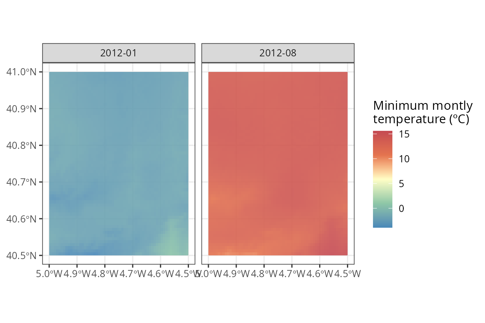

# Analysing the climate of an area for a given period

With {easyclimate} you can easily download daily, monthly and annual
climate data for a given set of points or polygons within Europe. To
download and install the latest version of {easyclimate} from GitHub
follow the instructions in <https://github.com/VeruGHub/easyclimate>

  

In this tutorial we will work through the basics of using {easyclimate}
with a spatial polygon.

If you wish to download the climatic data of a specific region, you need
to specify at least four corners of the polygon including the area and
specify the type of output you want to obtain (i.e. a data frame - `df`
or a raster - `raster`). You can also provide the polygons of interest
in a `sf` object.

``` r
library(easyclimate)
library(terra)

coords_t <- vect("POLYGON ((-4.5 41, -4.5 40.5, -5 40.5, -5 41))")

Sys.time() # to know how much it takes to download
## [1] "2025-12-18 21:36:17 CET"

df_tmax <- get_daily_climate(
  coords_t,
  period = c("2012-01-01", "2012-08-01"),
  climatic_var = "Tmax",
  output = "df" # return dataframe
  )

Sys.time()
## [1] "2025-12-18 21:40:32 CET"

head(df_tmax)
##   ID_coords       lon      lat       date Tmax
## 1         1 -4.995833 40.99583 2012-01-01 8.59
## 2         1 -4.987500 40.99583 2012-01-01 8.48
## 3         1 -4.979167 40.99583 2012-01-01 8.57
## 4         1 -4.970833 40.99583 2012-01-01 8.56
## 5         1 -4.962500 40.99583 2012-01-01 8.55
## 6         1 -4.954167 40.99583 2012-01-01 8.54
```

``` r
library(dplyr)

clim_df <- df_tmax |> 
  mutate(
    date = as.Date(date)
  ) 
```

Then, you can visualize the results and compare both dates:

``` r

library(ggplot2)

tapply(clim_df$Tmax, clim_df$date, summary)
## $`2012-01-01`
##    Min. 1st Qu.  Median    Mean 3rd Qu.    Max. 
##    8.28   10.15   11.94   11.66   12.98   15.07 
## 
## $`2012-08-01`
##    Min. 1st Qu.  Median    Mean 3rd Qu.    Max. 
##   25.88   28.71   29.22   29.10   29.61   33.50

ggplot() +
    geom_raster(data = clim_df,
        aes(x = lon, y = lat, fill = Tmax)) +
  scale_fill_gradient2(name = "Maximum\ntemperature",
                       low = "#4B8AB8", mid = "#FAFBC5", high = "#C54A52",
                       midpoint = 21, ) +
  facet_wrap(~date) +
    ylab("Latitude") + xlab("Longitude") +
  theme_bw()
```


You can get a (multi-layer) raster directly as output, if you specify
`output = raster`:

``` r

library(tidyterra)

Sys.time()
## [1] "2025-12-18 21:40:34 CET"

ras_tmin <- get_daily_climate(
  coords_t,
  period = c("2012-01-01", "2012-08-01"),
  climatic_var = "Tmin",
  output = "raster" # return raster
  )

Sys.time()
## [1] "2025-12-18 21:40:52 CET"

ras_tmin
## class       : SpatRaster 
## size        : 60, 60, 2  (nrow, ncol, nlyr)
## resolution  : 0.008333333, 0.008333333  (x, y)
## extent      : -5, -4.5, 40.5, 41  (xmin, xmax, ymin, ymax)
## coord. ref. : lon/lat WGS 84 (EPSG:4326) 
## source(s)   : memory
## varname     : DownscaledTmin2012_cogeo 
## names       : 2012-01-01, 2012-08-01 
## min values  :      -2.54,       7.60 
## max values  :       1.84,      13.56

ggplot() +
  geom_spatraster(data = ras_tmin, alpha = 0.9) +
  facet_wrap(~lyr, ncol = 2) +
  scale_fill_whitebox_c(name = "Minimum\ntemperature (ºC)", palette = "muted") +
  theme_bw()
```


You can also get a raster of monthly and annual climate data for an
area:

``` r

Sys.time()
## [1] "2025-12-18 21:40:54 CET"

ras_monthly_tmin <- get_monthly_climate(
  coords_t,
  period = c("2012-01", "2012-08"),
  climatic_var = "Tmin",
  output = "raster" # return raster
  )

Sys.time()
## [1] "2025-12-18 21:40:55 CET"

ras_monthly_tmin
## class       : SpatRaster 
## size        : 60, 60, 2  (nrow, ncol, nlyr)
## resolution  : 0.008333333, 0.008333333  (x, y)
## extent      : -5, -4.5, 40.5, 41  (xmin, xmax, ymin, ymax)
## coord. ref. : lon/lat WGS 84 (EPSG:4326) 
## source(s)   : memory
## varname     : DownscaledTmin2012MonthlyAvg_cogeo 
## names       : 2012-01, 2012-08 
## min values  :   -3.89,   10.11 
## max values  :    0.60,   15.59

ggplot() +
  geom_spatraster(data = ras_monthly_tmin, alpha = 0.9) +
  facet_wrap(~lyr, ncol = 2) +
  scale_fill_whitebox_c(name = "Minimum montly\ntemperature (ºC)", palette = "muted") +
  theme_bw()
```



  

## Learn more

Now you know how to extract climatic variables with {easyclimate}, for a
specific area. Check out this [other
vignette](https://verughub.github.io/easyclimate/articles/points-df-mat-sf.html)
if you need to extract the data for specific points.
