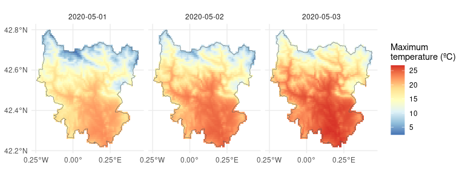

# `easyclimate` [](https://verughub.github.io/easyclimate/)

# Easy access to high-resolution daily, monthly and annual climate data for Europe

Get high-resolution (1 km) daily, monthly and annual climate data
(precipitation, and average, minimum and maximum temperatures) for
Europe from the European climatic database hosted at the [Institute of
Silviculture, University of Natural Resources and Life Sciences, Vienna,
Austria](https://boku.ac.at/en/oekb/wald). Data are currently available
from 1950 to 2024.

This climatic dataset was originally built by [A. Moreno & H.
Hasenauer](https://doi.org/10.1002/joc.4436) and further developed by W.
Rammer, C. Pucher & M. Neumann (see [this
document](https://github.com/VeruGHub/easyclimate/blob/master/inst/Description_Evaluation_Validation_Downscaled_Climate_Data_v2.pdf)
for more details on the development and characteristics of the climatic
dataset, and [this
document](https://doi.org/10.6084/m9.figshare.22962671.v1) for the
updates of the last version - v4).

In this R package we implemented [Cloud-Optimised
Geotiffs](http://cogeo.org/) so that we can obtain daily, monthly and
climate data for thousands of sites/dates within seconds/minutes,
without having to download huge rasters. But if you need to obtain data
for large areas, please download the rasters from the FTP server
(<ftp://palantir.boku.ac.at/Public/ClimateData/>) and extract the values
locally rather than using this package, so as not to saturate the file
server. For that, you may use a FTP client such as
[FileZilla](https://filezilla-project.org/).

Please, be aware that data will be updated in an annual basis and values
for past years might have small adjustments according to the annual
spring releases of [E-OBS
data](https://surfobs.climate.copernicus.eu/dataaccess/access_eobs.php#datafiles).
If you need to guarantee reproducibility of your analyses, please save
the data locally as some data might change without notice after such
updates.

For a detailed description of {easyclimate}, please read [this
paper](https://doi.org/10.1016/j.envsoft.2023.105627) (open access
version [here](https://doi.org/10.32942/osf.io/mc8uj)) or visit the
package [website](https://verughub.github.io/easyclimate/).

## Installation

Stable version from
[CRAN](https://cran.r-project.org/package=easyclimate):

``` r
install.packages("easyclimate")
```

Development version from
[GitHub](https://github.com/VeruGHub/easyclimate):

``` r
# install.packages("remotes")
remotes::install_github("VeruGHub/easyclimate")
```

Development version from
[R-universe](https://verughub.r-universe.dev/easyclimate):

``` r
install.packages('easyclimate', 
                 repos = c('https://verughub.r-universe.dev', 'https://cloud.r-project.org'))
```

## Examples

### Obtain a data frame of climatic values

To obtain a data frame of daily and monthly climatic values for point
coordinates:

``` r
library(easyclimate)

coords <- data.frame(lon = -5.36, lat = 37.40)

prec_daily <- get_daily_climate(coords, 
                                period = "2001-01-01:2001-01-03", 
                                climatic_var = "Prcp")
```

| ID_coords |   lon |  lat | date       | Prcp |
|----------:|------:|-----:|:-----------|-----:|
|         1 | -5.36 | 37.4 | 2001-01-01 | 8.24 |
|         1 | -5.36 | 37.4 | 2001-01-02 | 1.12 |
|         1 | -5.36 | 37.4 | 2001-01-03 | 2.40 |

``` r
prec_monthly <- get_monthly_climate(coords,
                                    period = "2001-01:2001-03",
                                    climatic_var = "Prcp")
```

| ID_coords |   lon |  lat | date    |   Prcp |
|----------:|------:|-----:|:--------|-------:|
|         1 | -5.36 | 37.4 | 2001-01 | 128.56 |
|         1 | -5.36 | 37.4 | 2001-02 |  16.24 |
|         1 | -5.36 | 37.4 | 2001-03 | 119.71 |

  

### Obtain a raster of climatic values

To obtain a (multi-layer) raster of daily climatic values for an area:

``` r
library(terra)

## Download the polygon contour of a region
sobrarbe <- mapSpain::esp_get_comarca(comarca = "Sobrarbe")

## Coordinates must be in lonlat 
sobrarbe <- project(vect(sobrarbe), "EPSG:4326")

## Download Tmax values for that region between 1st and 3rd May 2020
sobrarbetemp <- get_daily_climate(
  coords = sobrarbe,
  climatic_var = "Tmax",
  period = "2020-05-01:2020-05-03",
  output = "raster"
)
```

The output (`sobrarbetemp`) is a SpatRaster with 3 layers (for each of 3
days):

``` r
sobrarbetemp
#> class       : SpatRaster 
#> size        : 70, 82, 3  (nrow, ncol, nlyr)
#> resolution  : 0.008333333, 0.008333333  (x, y)
#> extent      : -0.2416667, 0.4416667, 42.21667, 42.8  (xmin, xmax, ymin, ymax)
#> coord. ref. : lon/lat WGS 84 (EPSG:4326) 
#> source(s)   : memory
#> varname     : DownscaledTmax2020_cogeo 
#> names       : 2020-05-01, 2020-05-02, 2020-05-03 
#> min values  :       1.61,       5.47,       7.58 
#> max values  :      22.71,      26.86,      28.14
```

Let’s make a map. First using terra:

``` r
plot(sobrarbetemp, col = rev(RColorBrewer::brewer.pal(9, "RdYlBu")), 
     smooth = TRUE, nc = 3)
```


Now using ggplot2 and tidyterra:

``` r
library(ggplot2)
library(tidyterra)

ggplot() +
  geom_spatraster(data = sobrarbetemp) +
  facet_wrap(~lyr, ncol = 3) +
  scale_fill_distiller(palette = "RdYlBu", na.value = "transparent") +
  geom_spatvector(data = sobrarbe, fill = NA) +
  labs(fill = "Maximum\ntemperature (ºC)") +
  scale_x_continuous(breaks = c(-0.25, 0, 0.25)) +
  scale_y_continuous(breaks = seq(42.2, 42.8, by = 0.2)) +
  theme_minimal()
```



  
Visit the articles of the [package
website](https://verughub.github.io/easyclimate/) for more extended
tutorials!

  

## CITATION

If you use {easyclimate}, please cite both the appropriate data source
and the package as:

Moreno A, Hasenauer H (2016). “Spatial downscaling of European climate
data.” *International Journal of Climatology*, 1444–1458.
<https://doi.org/10.1002/joc.4436>.

Pucher C (2023). *Description and Evaluation of Downscaled Daily Climate
Data Version 4*. <https://doi.org/10.6084/m9.figshare.22962671.v1>.

Cruz-Alonso V, Pucher C, Ratcliffe S, Ruiz-Benito P, Astigarraga J,
Neumann M, Hasenauer H, Rodríguez-Sánchez F (2023). “The easyclimate R
package: Easy access to high-resolution daily climate data for Europe.”
*Environmental Modelling & Software*, 105627.
<https://doi.org/10.1016/j.envsoft.2023.105627>.
